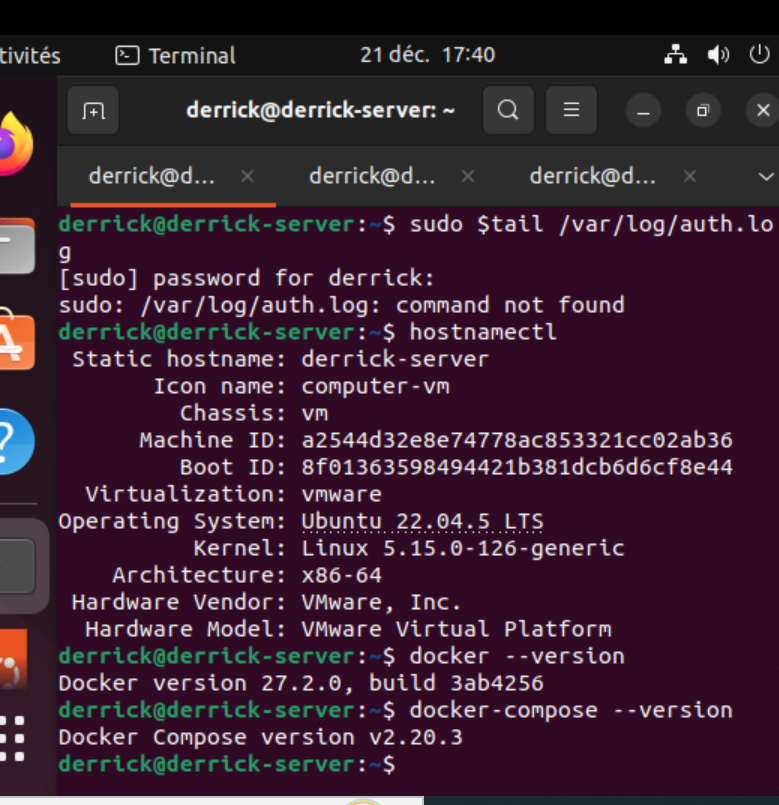
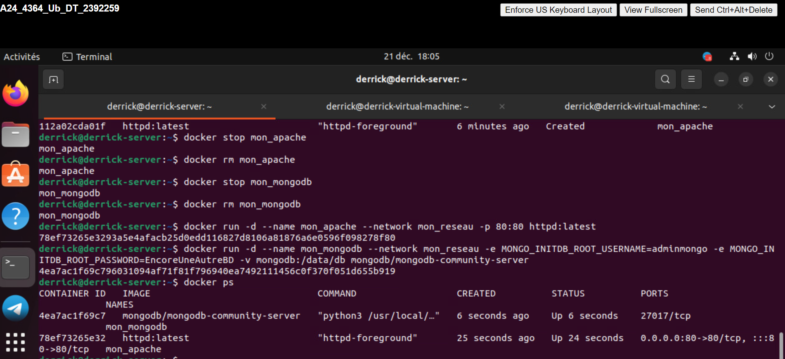
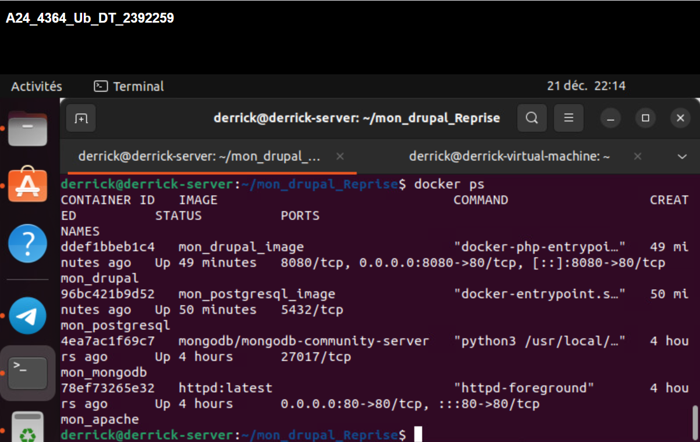
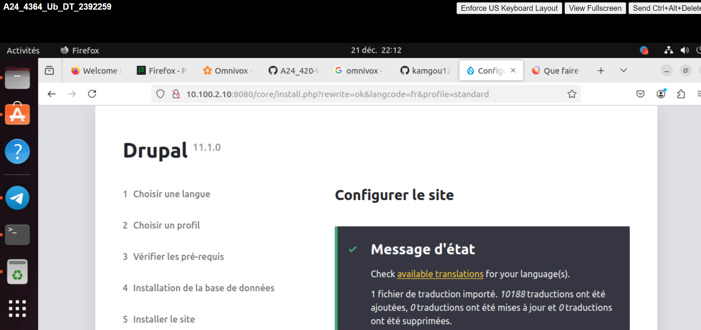

# Travail pratique 2 - 420-W45-S

 
**Votre Nom**: Derrick Tamfu  
**Date**: 21 décembre 2024  

## Description
   Ce projet contient une image Docker personnalisée pour Drupal et PostgreSQL. 
   Il permet de tester Drupal avec une base de données PostgreSQL.

## Contenu
- **drupal/** : Contient les fichiers liés à l'installation et configuration de Drupal.
- **postgresql/** : Contient les fichiers pour gérer la base de données PostgreSQL.

## Références
- [Drupal Documentation](https://www.drupal.org/documentation)
- [PostgreSQL Documentation](https://www.postgresql.org/docs/)
# Assignment Docker

## Étape 1: Vérification de l’installation

### Commandes utilisées
  docker --version
  docker-compose --version
  

### Capture d’écran

## Étape 2 : Création de conteneurs

### Commandes utilisées
- Création du réseau :

  docker network create mon_reseau
  
- Création du conteneur Apache :
  
  docker run -d --name mon_apache --network mon_reseau -p 80:80 httpd:latest
 
- Création du conteneur MongoDB :

  docker run -d --name mon_mongodb --network mon_reseau -e MONGO_INITDB_ROOT_USERNAME=adminmongo -e MONGO_INITDB_ROOT_PASSWORD=EncoreUneAutreBD -v mongodb:/data/db mongodb/mongodb-community-server

- Vérification des conteneurs :
 
  docker ps

## Étape 3 : Construction personnalisée d'une image pour Drupal

### Commandes utilisées
1. **Créer la structure de répertoires** :
   
   mkdir mon_drupal
   cd mon_drupal
   mkdir drupal postgresql
   touch README.md
   

2. **Créer le Dockerfile pour Drupal** :
   ---dockerfile---
   FROM drupal

   RUN apt update && apt install -y git && \
       rm -rf /var/lib/apt/lists/*

   WORKDIR /var/www/html/themes
RUN git clone --branch 5.0.x --single-branch --depth 1 https://git.drupalcode.org/project/bootstrap.git && \
       chown -R www-data:www-data bootstrap

   WORKDIR /var/www/html

   EXPOSE 8080
   

3. **Créer le Dockerfile pour PostgreSQL** :
   ---dockerfile--
   FROM postgres:latest

   ENV POSTGRES_DB=drupal
   ENV POSTGRES_USER=drupal_user
   ENV POSTGRES_PASSWORD=drupal_password

   VOLUME drupal-data:/var/lib/postgresql/data
   

4. **Construire les images** :

   docker build -t mon_drupal_image ./drupal
   docker build -t mon_postgresql_image ./postgresql
  
   
5. **Lancer les conteneurs** :
 
   docker run -d --name mon_postgresql --network mon_reseau -v drupal-data:/var/lib/postgresql/data mon_postgresql_image
   docker run -d --name mon_drupal --network mon_reseau -p 8080:80 mon_drupal_image

## Étape 4 : Accéder à l'application Drupal

1. Dans firefox  access a drupal depuis mon seveur sur mon client  à `http://10.100.2.10:8080`.
2.-10.100.2.10 est l'address de mon serveur 

## Sources
- [Documentation officielle de Docker](https://docs.docker.com/)
- [Docker Hub - Drupal](https://hub.docker.com/_/drupal)
